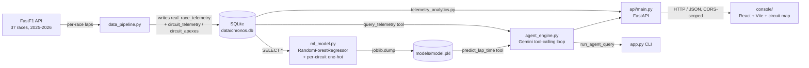

# Chronos — F1 Race Strategy & Predictive Analytics Engine

Chronos is a decision-support prototype for race strategists: it ingests real Formula 1
telemetry across **37 races spanning the 2025 season through the 2026 season to date**,
trains a lap-time model conditioned on circuit, tyre age, and compound, and exposes it all
through a natural-language agent and a live console — so a strategist can ask "Driver 44
is on Lap 18 with Mediums at Monaco, should we pit?" and get a data-backed answer for
that specific race, not a guess averaged across every track that's ever run.

## System Architecture



**Flow:**
1. `data_pipeline.py` pulls lap-level telemetry from the [FastF1](https://docs.fastf1.dev/)
   API for every completed race across the years you ask for — `fetch_and_store_season_range`
   walks the real F1 calendar (`fastf1.get_event_schedule`), skips races that haven't run yet,
   and appends each into one SQLite table (`real_race_telemetry`) tagged with `Year` and
   `EventName`. A single failed race is logged and skipped, not fatal to the batch. It also
   fetches, on demand, real X/Y position telemetry for one race at a time (fastest lap only)
   into `circuit_telemetry`/`circuit_apexes` for the track-map view — full position telemetry
   is much heavier than lap data, so it's never pulled for all 37+ races up front.
2. `ml_model.py` engineers features (lap number, tyre life, one-hot compound, **one-hot
   circuit**) and trains a `RandomForestRegressor`. The circuit feature is not optional:
   lap time is dominated by which track a lap was driven on (Monaco ~75s vs. Spa ~105s+)
   far more than by tyre age, so `predict_lap_time` requires an `event` argument and raises
   on an event it wasn't trained on, the same way it already raised on an unknown compound.
3. `agent_engine.py` exposes two tools to Gemini — `query_telemetry` (read-only SQL) and
   `predict_lap_time` (the trained, circuit-aware model) — via the `google-genai` SDK's
   automatic function calling. The system prompt tells the agent the table spans many
   races and to run a `DISTINCT Year, EventName` query (or ask the user) when a prompt
   doesn't say which one.
4. `src/telemetry_analytics.py` computes leaderboards, gaps, degradation series, sector
   splits, and the circuit map — every race-scoped function takes a `(year, event_name)`
   pair, defaulting to the most recently ingested race when the caller doesn't specify one.
5. `api/main.py` is a FastAPI service fronting all of the above over HTTP — the only thing
   the browser talks to. `GET /api/events` lists every ingested race for the console's
   selector; every other race-scoped endpoint takes optional `year`/`event` query params.
6. `console/` is a React + Vite + Three.js dashboard with a race selector (all 37 events),
   a real circuit-outline map with detected corner apexes, and a per-driver sector-time
   leaderboard — alongside the existing telemetry, degradation, and agent panels.
7. `app.py` is the CLI (`ingest`, `ingest-season`, `train`, `agent`). `streamlit_app.py` is
   a one-page web UI over `run_agent_query`, for demoing the agent without the full console.

## Honesty about what's real

FastF1 (and public F1 timing generally) does **not** publish tyre wear, carcass
condition, tyre temperature, ERS charge, or brake bias — that's proprietary team
telemetry. Rather than fabricate plausible-looking numbers for those, Chronos:

- Grounds everything it can in real fields: lap/sector times, track position, gaps
  (derived from FastF1's own cumulative session-elapsed `Time` field, not a hand-rolled
  sum), tyre compound and age, speed traps, and — for the circuit map — real X/Y position
  telemetry from the fastest recorded lap, with corner apexes detected as local minima in
  the real speed trace.
- Produces exactly one estimated value — `estimate_wear_index()` in
  `telemetry_analytics.py` — from tyre age vs. typical compound stint length. It is
  always returned with `is_estimated: true` and a `method` string, and the console
  labels it "Estimated Wear Index," never as sensor data.
- Never runs a Monte Carlo simulation or computes a confidence percentage it doesn't
  have; the console's hero panel shows the agent's real tool-derived recommendation
  and the model's real predicted next-lap delta instead.
- Shows "circuit map unavailable" rather than a broken or fabricated track outline when
  FastF1's underlying data source genuinely doesn't have position telemetry for a given
  session (observed for a small number of races — see **Known limitations** below).

## Setup & Quickstart

```bash
# 1. Create and activate a virtual environment
python3 -m venv .venv
source .venv/bin/activate

# 2. Install dependencies
pip install -r requirements.txt

# 3. Configure secrets (required for the `agent` command and the API)
cp .env.example .env
# then edit .env and set GEMINI_API_KEY=... (free key: https://aistudio.google.com/apikey)

# 4. Ingest real race data - a single race, or every completed race in a season
python app.py ingest --year 2025 --gp "Monaco Grand Prix" --session R
python app.py ingest-season --years 2025 2026     # every completed race in both seasons

# 5. Train the (circuit-aware) lap-time model
python app.py train

# 6a. Ask the Chronos agent a question via the CLI - name the race, it spans many now
python app.py agent --prompt "Driver 44 is on Lap 18 with Mediums at Monaco 2025, should we pit now?"

# 6b. ...or via the one-page Streamlit UI
streamlit run streamlit_app.py

# 6c. ...or run the full console (two terminals)
uvicorn api.main:app --reload --port 8000     # terminal 1: backend
cd console && npm install && npm run dev       # terminal 2: frontend (http://localhost:3000)
```

The first `ingest` call for a given race downloads and caches session data under
`f1_cache/` (via `fastf1.Cache`), so re-running the same race is fast and offline-capable.
`ingest-season` for both full seasons takes roughly 15-20 minutes on a cold cache.

## Deploying

The commands above run everything locally. To put the API and console on the internet
(Render + Vercel, with a Dockerfile that works on any container host), see **[DEPLOY.md](DEPLOY.md)**.

## Known limitations

- **Circuit map coverage.** A small number of ingested races have no retrievable X/Y
  position telemetry in FastF1's underlying data source — confirmed by direct
  reproduction (a fresh `session.load()` retry hits the identical
  `DataNotLoadedError`), not a bug in this code. The API returns `available: false` and
  the console shows "Circuit map unavailable" rather than crashing or fabricating one.
- **Cross-track model accuracy.** Full RMSE/R² across all 37 races is lower (~4.9s /
  0.87) than the original single-race model (~2.1s / 0.93) - expected, since predicting
  across circuits as different as Monaco and Spa is a materially harder problem than
  predicting within one race. The model doesn't yet account for safety cars/VSCs
  inflating some training laps, which is a known source of the remaining error.

## A note on the free-tier Gemini model

`GEMINI_MODEL` defaults to `gemini-flash-lite-latest` (Google's rolling alias, so it
won't go stale the way a pinned version eventually does). The free tier caps requests
per day per model — expect to hit `429` during heavy testing. `agent_engine.py` also
retries transient `503`s and the rarer case where the model ends a turn on a dangling
tool call with no narrated summary (both observed in practice, not hypothetical), and
raises `automatic_function_calling`'s call cap from the SDK default of 10 to 24, since
a thorough multi-compound, multi-race comparison can legitimately need more than 10
tool calls.

## Business Use Case

Race strategy decisions — when to pit, which compound to fit — are made under time
pressure from a mix of gut feel and dashboards. Chronos frames this as a **copilot**
problem: keep the strategist in charge, but let them interrogate live telemetry and a
tyre-degradation model in plain language instead of writing SQL or reading a raw data
grid mid-session. The SQL and prediction tools are deliberately separate from the
language layer so the numeric answers stay auditable — `run_agent_query` returns the exact
tool calls Gemini made alongside its answer, so every recommendation can be traced back to
a query and a model output rather than free-generated text.

Three guardrails matter here because the model writes its own SQL and spans many races:
`query_telemetry` opens SQLite in read-only mode and rejects anything that isn't a single
`SELECT`; `predict_lap_time` raises on an unrecognised compound *or* an unrecognised
circuit instead of silently returning a blind prediction; and the system prompt requires
the agent to disambiguate which race a question is about rather than guessing.

## Project Layout

```
chronos-ai/
├── .env                     # local secrets (gitignored)
├── .env.example             # template for .env
├── .gitignore
├── app.py                   # CLI entrypoint (ingest / ingest-season / train / agent)
├── streamlit_app.py         # one-page Streamlit UI over run_agent_query
├── requirements.txt
├── data/
│   └── chronos.db            # generated by `app.py ingest` / `ingest-season`
├── api/
│   └── main.py                # FastAPI service consumed by console/
├── src/
│   ├── data_pipeline.py        # FastF1 -> SQLite ingestion (single race + full seasons)
│   ├── ml_model.py             # feature engineering + RandomForest, circuit-aware
│   ├── telemetry_analytics.py  # leaderboard / gap / degradation / sector / circuit-map math
│   └── agent_engine.py         # SQL + prediction tools, Gemini tool-calling loop
└── console/
    ├── src/App.tsx              # dashboard shell, race selector, live data wiring
    ├── src/apiClient.ts         # typed fetch client for api/main.py
    ├── src/strategyEngine.ts    # adapts agent tool_calls into UI trace items
    └── src/components/          # ChassisVisualizer, TyreCrossoverChart, CircuitMap
```
